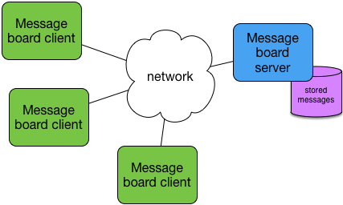

Message board application
-------------------------

Overview
^^^^^^^^

The first part of this exercise is to write code to complete the networking components of a "message board" client application.  The idea of a message board application is similar to a chat room: a central server stores messages posted by any number of clients.  Clients can post new messages to the message board, and retrieve the current list of messages stored on the server.

The diagram below depicts the overall structure of the message board application:

Your task
^^^^^^^^^^

Your task is to complete the ``MBclient`` program.  The template for this program currently implements a very simple text-based command-line interface.  When you run the program, you'll get a prompt at which you can use the commands "get", "post", and "quit".  The "get" and "post" correspond to requests to be made to the message board server, as described below; these are the two main commands that you'll need to implement (including all network interaction implied by these commands).

You can structure the client program in any reasonable way, but make it a *good* structure.  

Application message formats
^^^^^^^^^^^^^^^^^^^^^^^^^^^

The format of an application layer depends on whether the message is a *request to retrieve* messages from the server, a *request to post a new message* to the server, or a response generated from one of these requests, as described next.

Requesting messages from the server
"""""""""""""""""""""""""""""""""""

Each message on the server is identified by an integer.  A client can request messages from the server in one of three ways:

 * ``GET``: This is a request to retrieve *all* messages from the server.

 * ``GET <startmsgid>``: This is a request to retrieve messages starting at id ``<startmsgid>`` to the highest-numbered message.

 * ``GET <startmsgid> <endmsgid>``: This is a request to retrieve messages between id's ``<startmsgid>`` and ``<endmsgid>``, not inclusive of the end message id.  For example, if the request ``GET 0 2`` is made, messages with id's 0 and 1 will be returned, if they exist.

Responses to a ``GET`` request are as follows:

 * If an malformed ``GET`` request is sent to the server, the server will respond with ``ERROR`` a space, and some explanatory text for why the error occurred.

 * If a ``GET`` request is accepted, the server will respond with 0 or more datagrams, with each datagram containing a single message.  (Note that if there are no messages stored on the server, the server will not respond at all.)

   The format of a message response is the following::

        MSG <id> @<user>::<timestamp>::<message text>

   In other words, the response is the string ``MSG`` followed by a space, followed by the message id, followed by another space, then followed by the message data.  The message data includes three parts: the name of the user that posted the message (prepended with an ``@`` character), a timestamp (as a string), and the message text.  The three parts of the message are separated by double-colons (``::``).

   Here's an example of what a message sent by the server may look like::

       MSG 13 @system::2017/02/02 18:23:40:: You've been leading a dog's life.  Stay off the furniture.

   Note that there is no indication of how many messages the server may respond with.  It is up to the client to receive messages (and/or error messages) as they asynchronously arrive, and to correctly handle them.

Posting a new message to the server
"""""""""""""""""""""""""""""""""""

To request that a new message be posted to the server, the application data must consist of the following:

  * The string POST
  * One space
  * The username string
  * The two-character string "::"
  * The message string

The username string can be no more than 8 characters, and the message string can be no more than 60 characters.  If either of these values exceeds the maximum sizes, the server will respond with an ``ERROR`` message.

As an example, if the user "me" is posting the message "eat more ketchup", the full request string should be ``POST me::eat more ketchup``.

Note that because the string "::" is used as a delimiter between the user name and message, it MUST NOT appear in the username or message, otherwise the server has no way to determine the correct username or message.

In response to a POST request, the application data response from the server will either be:

  * The six character string ``POSTOK`` and the id of the accepted message, separated by a space, or
  * The five character string ERROR, a space, then an explanation string describing what went wrong.

Python Socket Library (and friends)
^^^^^^^^^^^^^^^^^^^^^^^^^^^^^^^^^^^

You'll need to use the Python socket library for sending and receiving network messages and communicating with the message board server.  An overview of the relevant operations in that library is listed below.  For the full documentation, see http://docs.python.org/3/library/socket.html.

  * ``socket.socket()``: this function creates and returns a new socket object.  Like it's C counterpart, it takes three parameters: the socket family name (which should be ``AF_INET``), the socket type (which should be ``SOCK_DGRAM`` for this project), and the protocol (which should just be zero, causing the socket function to create and return a UDP socket).

The socket object returned from the above function has three methods you should be aware of (which are analogous to the same functions in the C socket library):

  * ``sendto(data, addr)``.  This method takes two parameters: the data to send (as a bytes object), and an address tuple.  The address tuple should consist of the (IP address, port) pair that the data should be sent to.  Recall that the ``__init__`` method in the MessageBoardNetwork class should receive these items as parameters; you'll need to hold on to these parameters (in instance variables) so that you can use them with sendto.  This method returns the number of bytes sent, or throws an exception on error.

    To create a bytes object from a string, use the ``encode`` method, which returns a bytes object.  For example, ``s.encode()``.

  * ``recvfrom(buflen)``.  This method takes one parameter: the maximum amount of data to receive on the socket (in number of bytes).  You can simply use the value 1500 for this project.  This method returns a (bytes, address) tuple where bytes is the data received as a bytes object, and the address is a tuple containing the IP address and port of the host from which the data was received.

    To convert a bytes object to a string, you can use the ``decode`` method, e.g., ``b.decode()`` returns a string.

  * close().  This method closes the socket.

In addition, you will need to use the ``select`` function in the Python ``select`` module.  The ``select`` function allows a programmer to determine whether a socket has data ready to be received on it.  By default, a call to ``recvfrom`` will block forever, which would make our application unresponsive.  You're going to use ``select`` to avoid blocking and to determine when we should give up on waiting for a response from the server.

The ``select`` function in Python takes three parameters: a list of sockets to be read from, a list of sockets to be written to, a list of sockets to detect errors on, and a timeout value in seconds, i.e., ``select(readlist, writelist, errlist, timeout)``.

The pattern that you should use in your interactions with the message board server is as follows:

  * Send a GET or POST request to the server, using the ``sendto`` socket method

  * Call ``select``, using only your socket in the readlist (but with empty lists for writelist and errlist), and a value of 0.25 for the timeout (250 millseconds, or one quarter of a second).

    You may receive multiple response datagrams from the server in the case of a ``GET`` request; your code will need to be able to correctly and gracefully handle the arrival of responses from the server as they come.

The return value from ``select`` is a tuple of three lists corresponding to the first three arguments; each contains the subset of the corresponding file descriptors that are ready.  So, for example, if your socket has data waiting on it to be received, the readlist returned will have one element.  If the server did not respond in time, or the server is not running, or you sent the request to the wrong address (thus there is no server that can be respond), the readlist will be empty.  

Full documentation for select is available here: http://docs.python.org/3/library/select.html#select.select.

For each of the GET and POST requests, you should only try the operation once.  If it fails either due to the server not responding, or an ERROR response by the server, you should not retry the operation.  Instead, just display some kind of message indicating the failure.  

When checking for datagrams returned by the server, you should *keep* checking for new datagrams as long as they are received.  At the point that your call to ``select`` times out, you should go back to accepting the next command at the command-line.  

Testing
^^^^^^^

A compiled version of the server is available to use for testing purposes.  To start the server, open a terminal and type::

    $ python3 MBserver.pyc

You should see some output from the server as it runs.  It will randomly add messages to the message board, just to make things semi-interesting.

To run your client program and test with the server, you can open a terminal and type::

    $ python3 MBclient.py

It will ask for a user name (you can type anything you like) and open the view.  Initially, it will not do anything: you'll need to fix that!

Once you've tested the code on your own computer, you can try testing it with a remote server (assuming one has been set up for you).

License
-------

This work is licensed under a Creative Commons Attribution-NonCommercial-ShareAlike 4.0 International License.
http://creativecommons.org/licenses/by-nc-sa/4.0/
