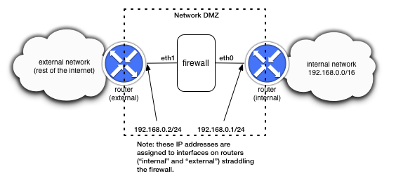

Overview
--------

The goal for this project is to create firewall that inspects and possibly changes packet contents for packet traffic entering and exiting a network.  The firewall rules we will use will be simple static rules (i.e., no "stateful" or dynamic rules), with one twist: we'll add the option to rate-limit certain packet flows using the token bucket algorithm.

The firewall can either be created as an extension of the IPv4 router project, or as a separate device that *silently* inspects and possibly blocks traffic.  The silent version of the firewall is described below.  To integrate the firewall with the router, you would need to apply firewall rules (described below) after receiving a packet and before any forwarding decision is made.  Again, the description below assumes a standalone device, but the differences between this and integrating with the router are quite minor.

Below is a picture of the example network topology that is implied by the tests, and that is created by the Mininet script supplied with this project.  The firewall for which you will be writing the logic is positioned at the exterior of a network to be protected ("internal network"), inside what is often referred to as the network DMZ.  The firewall has just two interfaces, and is connected such that it will "see" all traffic sent from the internal network out to the rest of the internet, and it will also see any traffic coming from the rest of the internet back to the internal network.  

Notice that there are only two interfaces assigned to the firewall device.  The basic behavior of your device is to simply forward packets from one interface to the other.  You do not need to any routing logic or anything like that.  The firewall logic (described below) should be applied after receiving a packet on one interface and before sending it out the other interface.  It is ok in this project to assume that you will only ever have 2 network interfaces on the firewall device.

Tasks to accomplish
-------------------

There are three things to accomplish for this project:

1. Implement firewalling logic based on a simple set of rules that are stored in a text file.

2. Implement a rate-limiting capability so that certain packet flows are given limited network bandwidth.

3. Implement a network impairment of your choice, designed to disrupt certain packet flows.

Details for each of these items are given below.

Task 1: Implement firewall rules
--------------------------------

We will use a fairly basic syntax, with no "stateful" rules.  All rules will be loaded from a text file named ``firewall_rules.txt``.  The syntax and semantics of the firewall rules are described in detail below.  As a preview and example, however, here is a rule that denies IP traffic (with any transport protocol) with source address 10.0.0.1 and any destination address::

	# block any packets with source address 10.0.0.1
	deny ip src 10.0.0.1 dst any

(Note that the lines beginning with # are just comments.)

The rules should be applied to packets just after they have been received at the firewall.  The firewall should apply just to IPv4 packets (not to ARP, IPv6, or any other type of packet).  In particular, non-IPv4 packets should *all be permitted*.  As described in detail below, rules can either permit or deny packets.  For packets that are permitted, they should simply be forwarded out the "other" interface by the firewall.  For any denied packets, they should be dropped/ignored and no further processing should be done on them.

Again, the syntax and meaning of the firewall rules is described below in detail.

Task 2: Implement the token bucket algorithm
--------------------------------------------

Rules that permit traffic may optionally have rate limits specified, in bytes per second.  Here is the same example rule from above, but with a rate limit specified as 1000 bytes per second::

	# allow, but rate-limit packets with src 10.0.0.1
	# destined to any address in the prefix 192.168.0.0/16
	# with limit as 1250 bytes/sec (10 kbit/s)
	permit ip src 10.0.0.1 dst 192.168.0.0/16 ratelimit 1000

When implementing the token bucket algorithm, you should do the following:

* Tokens should be semantically equated to some number of bytes allowed.  Thus, if there are 100 tokens in the bucket, you should allow 100 bytes to be forwarded.

* Tokens should be added to the bucket every 0.5 seconds.  If the rate limit configured is r bytes per second, exactly r/2 tokens should be added to the bucket every 0.5 seconds.  For the example above, you would add 500 tokens to the bucket every 0.5 seconds.

   * Note: from your experience in operating systems, you should know (or at least suspect) that OS timers are a wee bit fickle.  Just be aware of this fact and devise your code so that it doesn't assume a perfect timer, because a perfect timer doesn't exist.  Remember that in the ``net.recv_packet()`` call, there's a timeout value you can give in order not to block on the call.  In order to ensure you update the token bucket every 0.5 seconds, just manipulate the timeout value.  You may even wish to update the token bucket more often than 0.5 seconds; that's fine as long as you only add r/2 tokens every 0.5 seconds.

* The maximum number of tokens in the bucket is 2*r, where r is the configured rate limit in bytes/second.

* The minimum number of tokens in the bucket should be 0 (zero).

* When a packet arrives that matches a rule with a rate limit configured, you should (a) determine the size of the packet in bytes, including everything from the IP header onward (i.e., include everything except the Ethernet header), (b) check whether the packet size is less than or equal to the number of tokens.  If it is, subtract that number of tokens and allow the packet.  Otherwise, the packet should be dropped.  

To compute the packet size in bytes, you can get the size of the entire packet by saying ``len(packet)`` (assuming the variable ``packet`` is an instance of a ``Packet``), then subtract the size of the Ethernet header (``len(packet.get_header(Ethernet))``).  Note that the last expression assumes that the Ethernet header actually exists in the packet, but this should normally be the case.

Note that with this algorithm, if the rate limit is set too low, you may never allow any packets at all (e.g., if you set the limit to 15 bytes/sec, you'd never allow any TCP traffic since the smallest TCP packet is 40 bytes, which is greater than 2*15).  Also note that the rate limit you achieve is not expected to be exactly the specified rate limit.  

Task 3: Implement some other type of network impairment
-------------------------------------------------------

Rules that permit traffic may specify that the traffic flow should be impaired in some way.   A rule that specifies that traffic should be impaired should simply have the keyword impair as the last item in a rule.  For example::

	# allow, but degrade the service given to packets
	# from source 10.0.0.1 destined to any host in
	# 192.168.0.0/16.  
	permit ip src 10.0.0.1 dst 192.168.0.0/16 impair

You can choose exactly how flows should be impaired.  Here are some fun options:

* Randomly drop some fraction of the packets belonging to the flow.

* Rewrite/overwrite the TCP advertised window to make it smaller.

* Rewrite/overwrite the application payload contents of packets.

* Randomly inject TCP RST packets to reset (and take down) traffic flows.

Lastly, note that a given permit rule may specify a rate limit, that impairment should be applied, or that the traffic should simply be permitted.  A rule may not specify both a rate limit and impairment.

Firewall rule specification and syntax
--------------------------------------

The firewall rules to be loaded by the router must be included in a text file named ``firewall_rules.txt``.  The allowable syntax for rules is as follows::

	[permit|deny] ip src [srcnet|any] dst [dstnet|any]
	[permit|deny| icmp src [srcnet|any] dst [dstnet|any]
	[permit|deny] [udp|tcp] src [srcnet|any] srcport [portno|any] dst [dstnet|any] dstport [portno|any]

Note that items in square braces indicate items to be made concrete in a specific rule.  For example, a valid rule is::

	permit ip src 10.0.0.1 dst any

which would allow any IP packets (any protocol) with source address 10.0.0.1 and any destination address.  

Note that the ``srcnet`` or ``dstnet`` values may either be an exact IP address, or an IP prefix indicating a subnet of addresses.  Also, ``portno`` should be specified as a single integer between 0 and 65535.  ``any``, somewhat obviously, should match anything.  

Here is another example::

        deny tcp src 1.2.3.0/24 srcport any dst any dstport 80

This rule blocks any TCP traffic with source address in the range 1.2.3.0-255, with any source TCP port, any destination IP address, and a destination port of 80.  

It is straightforward to access TCP and UDP port numbers using the Switchyard packet library.  See the Switchyard documentation for details and examples.

You may also find the ``IPv4Network`` class useful (it is built in to the ipaddress module in Python 3.4).  You can instantiate an ``IPv4Network`` object by passing in a network address (with prefix) as a string.  On that object, you can get the prefix length as an integer, convert the address to an integer (to be able to bitwise operations), and other useful operations.  See the standard Python documentation for full details on the ``ipaddress`` module.

::

	>>> from ipaddress import IPv4Network, IPv4Address
	>>> net1 = IPv4Network('149.43.80.0/22')
	>>> net2 = IPv4Network('149.43.0.0/16')
	>>> net3 = IPv4Network('149.43.80.25', strict=False)
	>>>   # for above, if you don't have a prefix at the end of an address
	>>>   # you'll get an exception unless you say strict=False
	>>>   # w/o a prefix length, it assumes 32 bit prefix
	>>> net1.prefixlen
	22
	>>> net2.prefixlen
	16
	>>> net3.prefixlen
	32
	>>> net1.network_address
	IPv4Address('149.43.80.0')
	>>> int(net1.network_address)
	2502643712
	>>> net2.network_address
	IPv4Address('149.43.0.0')
	>>> int(net2.network_address)
	2502623232
	>>> int(net2.network_address) & int(net3.network_address) == int(net2.network_address)
	True
	>>> # of course, the above should be true because we're basically checking
	>>> # whether 149.43.80.25 is contained within the network 149.43.0.0
	>>> # by doing the bitwise & (AND) operation
	>>> 

Blank lines are allowed in the ``firewall_rules.txt`` file, and any line on which the first non-whitespace character is # should be ignored.  Thus, you should allow Python-like comments, but you do not need to handle the situation where a comment and a rule appear on the same line --- comments will always appear separately.

Rule order matters!  Packets should be checked against the rules in the same order as the rules are listed in firewall_rules.txt.  When a matching rule is found, the action (permit/deny) according to the rule should apply, and no more rules should be checked.  If no rules match, then the default action should be to permit the packet.  Note that in the example rule set below, the last rule explicitly drops all packets but your firewall should handle any reasonable rule set.

Rate limits can be applied to any "permit" rule.  To specify a rate limit, the syntax is "ratelimit [bytessec]", included at the end of a rule.  The rate limit accounting should apply to the entire packet except the Ethernet header (i.e., the packet size used for rate limit accounting should just include the IP header and beyond).

Impairment can be applied to any "permit" rule (although rate limits and impairment cannot be applied to the same rule).  The only additional syntax is the inclusion of the keyword impair at the end of the rule.

The project folder includes a ``firewall_rules.txt`` file. I'd recommend reading through this file to get familiar with the types of rules included in order to get a sense for how your firewall should behave.  

Testing
-------

There is a Switchyard test script available for basic firewalling capabilities (i.e., permit and deny rules without any rate limits or impairment).  This file is available in the project repo as firewalltests.srpy.  The source code for this test scenario is also included as firewalltests.py.  The test source is given since you may find it helpful to add new tests or modify existing tests as you develop your code.  As usual, you can test your code using a command line like::

	$ swyard -t firewalltests.srpy firewall.py

Note that you can either use ``firewalltests.srpy`` or ``firewalltests.py`` in the command line above.

There are minimal automated tests for the rate limitation features, and there are no automated tests for your impairment "feature".  The minimal rate limitation tests just check whether at least one packet is permitted by your firewall: these should all definitely pass.  There are no sophisticated tests for checking whether you impose the right rate limit on a flow.  To do that, you can use Mininet as described below.

To test your impairment feature, you can either construct a Switchyard test (or set of tests) or test your impairment feature in Mininet (somehow).  There is a file ``impairmenttest.py`` in the project directory that you can modify for testing your impairment feature with Switchyard if you wish.  There is some Switchyard documentation available to describe the meaning of various API calls in test scenario creation.

To try your firewall in Mininet, you can do the following::

	$ sudo python start_mininet.py

Once Mininet is started, open an xterm on the node named "firewall", and then start the firewall::

	mininet> xterm firewall

and on the firewall node::

	firewall# swyard firewall.py

There are two other hosts in the Mininet setup: one named "internal" and another named "external".

Testing rate limitation in Mininet
----------------------------------

To test rule 13 (``permit icmp src any dst any ratelimit 150``), you can use the following ping command within Mininet::

	mininet> internal ping -c10 -s72 192.168.0.2

This command will cause the "internal" host to send an ICMP echo request (ping) to the "external" host, through the firewall device.  There will be 10 echo request packets sent, once per second, and the size of each packet (from IP header through the end of the packet) will be 20 bytes (IP) + 8 bytes (ICMP header) + 72 bytes (the -s72 flag) of "data", resulting in a 100 byte packet.  The echo reply will also be exactly 100 bytes.

The "steady-state" effect of this ping command line and the rate limitation should be that every other ICMP echo request should be allowed.  (Think about why this is the case.  You'll likely allow the first couple echo request/replies, but then the every-other regime should take hold.)

There are two other rate limitation rules: rules 7 and 8 (replicated below)::

	# rule 7
	permit tcp src 192.168.0.0/16 srcport any dst any dstport 80 ratelimit 12500
	# rule 8 
	permit tcp src any srcport 80 dst 192.168.0.0/16 dstport any ratelimit 12500

To test these rules you can generate some HTTP traffic over port 80 using some simple command-line tools.  Note that these rules apply separate rate limits to each direction of the TCP connection and that the limit is equivalent to 100Kbits/sec.  To generate HTTP/port 80 traffic to exercise these limits, do the following.  On the host "external", start a server::

	mininet> external ./www/start_webserver.sh

Besides starting up a simple Python-based webserver, this script creates a file (called "bigfile", although it's actually pretty small) to transfer so that we can exercise the rate limit.

Now, on the internal host, make a request using the program ``wget``::

	mininet> internal wget http://192.168.0.2/bigfile -O /dev/null

(The ``-O /dev/null`` command-line parameter just says to save the response in ``/dev/null``, which is just a virtual wastebasket for bits.)

One other note regarding rate-limit testing: you shouldn't expect the rate limitation to work especially well in Mininet.  Your mileage may vary, but don't be surprised if you get very poor throughput with the firewall (and much less than the specified rate limit).

Testing impairments in Mininet
------------------------------

Testing your impairment capability depends on what you implemented.  One way to generate traffic (at least TCP traffic) for testing the impairment is to use the http server used for testing rate limits.  The rules for the impairment is as follows (see also firewall_rules.txt)::

	# rule 11 
	permit tcp src 192.168.0.0/24 srcport any dst any dstport 8000 impair
	# rule 12
	permit tcp src any srcport 8000 dst 192.168.0.0/24 dstport any impair

To start the webserver so that it listens on port 8000 (which is the port specified in the impair rule), you can say::

	mininet> external ./www/start_webserver.sh 8000

To generate traffic from internal to trigger the impair rule, you can use the ``wget`` program again::

	mininet> internal wget http://192.168.0.2:8000/filename

The filename you use can either be "bigfile" (i.e., the same file used in the rate limit tests) or it can be any file you construct.  If your impairment depends on certain application payload contents (e.g., you search packets to see whether the string "sneaky crackers" is present) you can craft files that have the desired contents.   If you save them in the www folder (directly within the project repo folder) you can use the wget program as above to request those files and trigger your impairment.

License
-------

This work is licensed under a Creative Commons Attribution-NonCommercial-ShareAlike 4.0 International License.
http://creativecommons.org/licenses/by-nc-sa/4.0/
