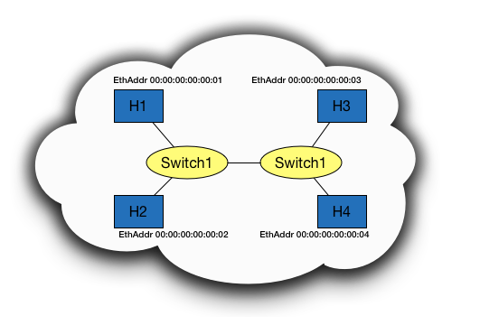
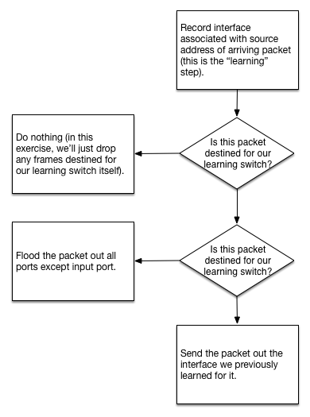

Overview
---------

In this exercise, you will write the code to implement the core logic in an Ethernet learning switch using the Switchyard framework.  Besides using Switchyard for developing and testing your switch, you can deploy it in Mininet to test it in a "live" setting. The code you'll need to add for the simplest version of this exercise should be less than 20 lines (and possibly quite a bit less depending on exactly how you write the code).  There are extensions to the basic learning switch that could add quite a bit more code.

Ethernet Learning Switch Operation
----------------------------------

An Ethernet learning switch is a device that has a set of interfaces ("ports") with links connected to other switches, and to end hosts.  When Ethernet frames arrive on any port/interface, the switch sends the frame on an appropriate output port if the switch knows that the host is reachable through that port, or floods the frame out all ports if it does not know where the host is.

Consider the picture below.  Say that Switch 1 doesn't know the locations of any host on the network, and that H1 wants to send an Ethernet frame to H3.  When that frame arrives at Switch 1, it sees Ethernet source address ``00:00:00:00:00:01`` and destination address ``00:00:00:00:00:03``.  From this packet arrival, it knows that it can now reach H1 by send a frame out the same interface on which this frame has arrived.  However, it does not know where to send to frame to reach H3, so it floods the packet out all ports except the one on which the frame arrived.  Eventually, H3 will receive the frame.  If it replies to H1, Switch 1 will receive a frame with the source address as H3's address, and the frame will arrive on the interface connected to Switch 2.  At this point, Switch 1 now knows exactly which ports it needs to use to send frames to either H1 or H3.
  

The following flowchart summarizes the example described above.  The only additional considerations shown in the flowchart are if the destination address is the same as one of the Ethernet addresses on the switch itself (i.e., the frame is intended for the switch), or the Ethernet destination address is the broadcast address (``FF:FF:FF:FF:FF:FF``).

  

Your Task
---------

Your task is to implement the logic in the above flowchart, using the Switchyard framework.  This directory contains a starter file named ``myswitch.py``, which is the only file you'll need to modify.

Two links to Switchyard API documentation which you may find helpful are: 

* Packet parsing/construction reference: http://cs.colgate.edu/~jsommers/switchyard/reference.html#packet-parsing-and-construction
* Ethernet packet header reference: http://cs.colgate.edu/~jsommers/switchyard/reference.html#ethernet-header

Note that the documentation has examples on running Switchyard in test mode and in real mode, along with a walkthrough of creating a simple hub device, which is useful background material for this exercise.

Extensions
----------

Implementing timeouts
^^^^^^^^^^^^^^^^^^^^^

Real learning switches remove forwarding table entries after some number of seconds have elapsed so that a learning switch can adapt to changes in network topology.  Implement a timeout feature in your learning switch.  Choose some reasonable value for a timeout (e.g., 30 seconds).

Implementing limited storage for rules learned
^^^^^^^^^^^^^^^^^^^^^^^^^^^^^^^^^^^^^^^^^^^^^^

Real learning switches also have limited storage for forwarding rules that are learned.  Implement a feature by which your learning switch can only hold a limited number of rules (implement this flexibly so that you can easily change the maximum number of rules).  When your switch needs to add a new rule but there is no more space, you can consider different policies for evicting an existing rule:

  * Evict the least recently used rule
  * Evict the rule that has observed the least amount of network traffic in terms of numbers of bytes.  How you *count* network traffic can be done in different ways: you could also consider number of packets, or number of *application payload bytes* (ignoring bytes from lower layer headers).
  * If there are ties when considering the above two policies, choose among those candidate rules to be evicted at random.

Implement a simplified spanning tree computation algorithm
^^^^^^^^^^^^^^^^^^^^^^^^^^^^^^^^^^^^^^^^^^^^^^^^^^^^^^^^^^

If you attempt to run your switch on multiple nodes within a virtual network using Mininet, and if there is a physical *loop* in the network, you will observe that packets will circulate infinitely.  Oops.  An interesting and challenging extension to the learning switch is to implement a simplified spanning tree computation algorithm.  Once the spanning tree is computed among switches in the network, traffic will only be forwarded along links that are part of the spanning tree, thus eliminating the loop and preventing packets from circulating infinitely.

To implement a spanning tree computation, you'll need to do the following:

  1. Add to your switch the notion of an *id*, which can just be an integer (or even a string).  The point is that each switch will need its own unique id, and there should be a simple way to compare ids.
  2. Create a new packet header type that includes two attributes: the id of the *root* node in the spanning tree, and the number of observed hops to the root.
  3. Add a capability to each switch so that when it starts up, it floods out spanning tree packets to determine and/or find out what node is the root.  Each switch needs to store a few things: the id of the current root (which is initialized to the switch's own id), the number of hops to the root (initialized to 0), and the time at which the last spanning tree message was received.  Each non-root node also needs to remember which interface on which spanning tree messages arrive.  

     Initially, a node assumes that it is the root.  The root node should be the only node that generates new spanning tree packets.  These packets are initialized with the switch's own id and 0 as the number of hops to the root.  The root note should emit new spanning tree packets every t seconds, where t is some configurable value, e.g., 1 second.

     When a node receives a spanning tree packet it examines the root attribute:

       * If the id in the received packet is *smaller* than the id that the node currently thinks is the root, the id in the received packet becomes the new root.  The node should then forward the packet out all interfaces except for the one on which the packet was received.  Prior to forwarding, the number of hops to the root should be incremented by 1.  The interface on which the spanning tree message arrived must be recorded, the time at which the message arrived should also be recorded, and the number of hops to the root (the value in the received packet + 1) must be recorded.

       * If the id in the received packet is *the same* as the id that the node currently thinks is the root, it examines the number of hops to the root value:

         * If the number of hops to the root + 1 is less than the value that the switch has stored, it *changes* the interface that it has recorded as on the spanning tree to the interface on which this packet has arrived.  The switch should then forward the spanning tree message out all interfaces except the one on which the message arrived, incrementing the number of hops to the root by 1 prior to forwarding.

         * If the number of hops to the root + 1 is greater than or equal to the value that the switch has stored, it ignores the spanning tree packet and does nothing else.

     A switch also needs to keep track of the time at which the last spanning tree packet was received.  If more than a configured number of seconds has elapsed (e.g., 30), a switch should declare itself the root and reinitiate the spanning tree process.

     Lastly, the learning switch forwarding algorithm changes a bit in the context of a spanning tree.  Instead of flooding a frame with an unknown destination Ethernet address out *every* port (except the one on which the frame was received), a switch only floods a frame out every port (again, except the input port) if the frame is received on the interface that leads toward the root of the spanning tree.  Frames with unknown destination Ethernet addresses that arrive on ports that do *not* lead directly to the root of the spanning tree should not be flooded or forwarded.

Testing and Deploying your Switch
---------------------------------

You should first develop your switch code using the Switchyard test framework.   Assuming you have installed Switchyard in a Python virtual environment and have activated that venv, you should run::

	swyard -t switchtests.srpy myswitch.py

The above command it will execute a series of test cases against your program and display whether the tests pass or fail.  Once you get the tests to pass, you can try running your code in Mininet.

Note that the tests are *not* included in this repository but they are available on request.

To run your switch in Mininet, run the ``switchtopo.py`` custom topology script.  It will create a small network consisting of a single switch with three hosts (client, server1, and server2) in the following configuration (note that only IP addresses of the 3 hosts are shown in the picture; Ethernet MAC addresses for each interface (6 interfaces total) are not shown).

To start up Mininet using this script, just type::

	$ sudo python switchtopo.py

Once Mininet starts up, you should open a terminal window on the Mininet node named "switch"::

	mininet> xterm switch

In the window that opens, run your switch in "real" (non-test) mode::

	# swyard myswitch.py

Note that to run ``swyard`` in Mininet in a root shell (such as the shell that is open in response to the ``xterm`` command), you will need to activate the Python virtual environment which has Switchyard installed in it.  Refer to the Switchyard documentation for more information.

To examine whether your switch is behaving correctly, you can do the following:

1. Open terminals on client and server1 (``xterm client`` and ``xterm server1`` from the Mininet prompt)
2. In the server1 terminal, run ``wireshark -k``.  Wireshark is a program that allows you to "snoop" on network traffic arriving on a network interface.  We'll use this to verify that we see packets arriving at server1 from client.
3. In the terminal on the client node, type ``ping -c 2 192.168.100.1``.  This command will send two "echo" requests to the server1 node.  The server1 node should respond to each of them if your switch is working correctly.  You should see at the two echo request and echo replies in wireshark running on server1, and you will probably see a couple other packets (e.g., ARP, or Address Resolution Protocol, packets).
4. If you run wireshark on server2, you should not see the echo request and reply packets (but you will see the ARP packets, since they are sent with broadcast destination addresses).

License
-------

This work is licensed under a Creative Commons Attribution-NonCommercial-ShareAlike 4.0 International License.
http://creativecommons.org/licenses/by-nc-sa/4.0/
