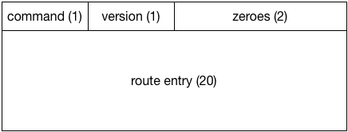
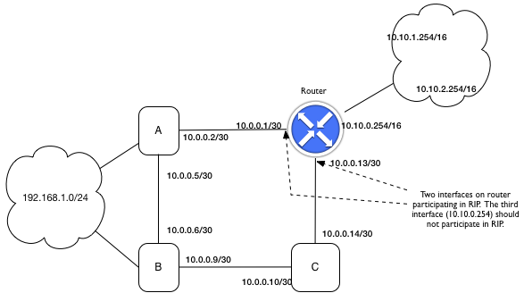

Distance vector routing
-----------------------

Overview
^^^^^^^^

The objective of this exercise is to add a *dynamic routing capability* to a Switchyard-based IPv4 router.  Your router already has a *static* routing capability, in which forwarding table entries are created based on the contents of a preconfigured text file.  In dynamic routing, *reachability* information is shared among routers.  Reachability may change over time, as links or interfaces go down or come back up, and thus routers participating in a dynamic routing protocol build a *current* understanding of where packets must be forwarded in order to reach certain destinations.

The particular variant of dynamic routing to implement in this exercise is *distance vector* routing.  A real-world implementation of distance vector routing is the Routing Information Protocol, also known (either humorously or unfortunately) as RIP.  The distance vector protocol described in this exercise is based on RIPv2, though there are some important differences.  This document is *not* intended to provide a full reference on distance vector routing; the focus rather on what must be implemented in your Switchyard router to create a RIPv2-like dynamic routing capability.  Note that the official specification of the RIPv2 protocol can be found at https://tools.ietf.org/html/rfc2453.  It is surprisingly readable and has some nicely written motivation and good examples of RIP's operation.

RIP packet header and addressing
^^^^^^^^^^^^^^^^^^^^^^^^^^^^^^^^

The Switchyard packet library contains an implementation of the RIPv2 protocol header (named ``RIPv2``).  The header contains ``command`` and ``version`` fields in the first two bytes, followed by two zero bytes.  After that, are 0 or more route entries (Switchyard class name ``RIPRouteEntry``).  The version number is *always* two (and the ``RIPv2`` header does not allow you to change this directly).  The command is one of two values: ``RIPCommand.Request`` or ``RIPCommand.Reply``.  Not surprisingly, ``Request`` is used when a sender of a RIPv2 packet wishes to request route entries from another router, and ``Reply`` is used when a router is generating a message that includes its own route entries.

..

Each ``RIPRouteEntry`` contains five fields: ``address``, ``netmask``, ``family``, ``metric``, and ``tag``.  Consider these fields in the context of a router A sending a *reply* to another router B: router A wishes to inform router B that A can reach a particular network address via a certain number of hops.  A brief explanation of the fields is then as follows:

``address``
    This is the IPv4 address of a *network* that can be reached.

``netmask``
    This is the subnet mask to be applied to the address to indicate the number of network vs. host bits in the address.

``family``
    This is generally always 2, indicating the Internet family of addresses.  In one particular case (described below) the family should be set to zero.

``metric``
    This is the number of "hops" between the advertiser of a route and the destination network.  For a directly-connected network, the metric is zero.  The variable ``RIP_INFINITY`` is defined in Switchyard as 16, consistent with the RIPv2 standard (and what you've probably read about RIP and distance vector routing).

``tag``
    Is a number that can be used in any way an implementation wishes, though it is typically used to indicate how the given route was learned.  For example, one tag value may indicate that the route is learned via a static configuration, another value may indicate that it is a directly-connected network, and another value may indicate it was learned through RIP, etc.  Switchyard doesn't care how or if you use this field.

A ``RIPRouteEntry`` is not a regular packet header, *per se*.  Thus, it cannot be added to an existing packet using the ``+`` operator.  Instead, you must use the ``append`` method on a ``RIPv2`` header to add a route entry.  Note that to access route entries that are contained in a ``RIPv2`` header, you can iterate over the ``RIPv2`` header with a regular ``for`` loop.  The ``RIPv2`` header also supports the ``len`` function (it returns the number of route entries) and indexing can be used to access individual route entries.

The ``RIPv2`` header must come *after* the ``UDP`` (and ``IPv4``) headers in a packet.  The UDP port used by RIP is 520.  Both source and destination ports in the ``UDP`` header should be set to this value, and any RIP packets received that do not have both source and destination ports set as 520 should be rejected.

``RIPv2`` packets should be sent to the IPv4 multicast address ``224.0.0.9``.  The source IPv4 address must be the address of the interface out which a ``RIPv2`` packet is sent.  While the RIPv2 RFC indicates that there are situations (or *a* situation) in which a RIPv2 packet may be sent to a unicast IPv4 address, for this exercise you should only use the given multicast address as the destination.

Lastly, you'll want to configure Switchyard's ``UDP`` header to be able to decode the ``RIPv2`` payload.  Two lines of code are needed to do this::

    UDP.set_next_header_class_key('dst')
    UDP.add_next_header_class(520, RIPv2)

The first line above tells the ``UDP`` class that the ``dst`` field (destination port) should be used as a "key" for looking up the class name of the *next header* in the packet.  The second line indicates that any data that follows the ``UDP`` header with destination port 520 should be interpreted as containing a ``RIPv2`` header.

RIP protocol actions
^^^^^^^^^^^^^^^^^^^^

The router that has been developed so far can (or should be able to) handle static routing information from a file, do longest prefix match lookups, forward packets, and generate standard ICMP error packets.   To add a RIP-like capability to the router, you should do the following:

1. Modify your start-up function (``main``) to accept a second parameter (besides the net object), which should be a list of interfaces that should participate in the RIP process.  Only the given list of interfaces should send ``RIPv2`` request messages (i.e., asking for a full table dump from neighbors), and only participating interfaces should be used when sending out unsolicited table dump replies.
   
   On start up, you can use the ``-g`` option to ``swyard`` to give a space-separated series of interfaces, which should also be quoted (e.g., ``-g "router-eth0 router-eth1"``).  Switchyard will convert these two strings into a list and pass them into your program.

2. You will need to expand the information stored in your forwarding table.  At minimum, you will need to include three new fields: *metric*, *last update*, and *how learned*.  

   * The *metric* should be an integer indicating the number of router hops from the current router to a given network.  Any directly connected networks should have metric 0.  

   * *Last update* is a timestamp that should indicate the last time at which this entry was updated.  

   * *How learned* should give some indication of how the particular forwarding table entry was learned, e.g., through a static entry, through RIP, or because it is a directly connected network.  

3. When the router first starts up, it should immediately send out full table requests on each RIP-participating interface.  The request message you send out should be exactly one route entry, which must have the ``family`` set to 0 and ``metric`` to infinity (16).  All other route entry fields should be set to zero (which will happen by default, though note that the default value for family is 2, so you must explicitly set this to 0).  This peculiar set of values in a route entry is specified by the RIPv2 RFC and is the secret RIPv2 way of saying "give me a dump of your entire forwarding table!"  Remember (from above) that the IPv4 source and destination addressed must be set carefully, and the UDP source and destination ports must be 520.

   Note that different types of requests *can* be created according to the RIPv2 RFC, but they are not required as part of this exercise. 

4. When a ``RIPv2`` *reply* is received, you should first verify that the IPv4 destination address is the required multicast address and that the UDP source and destination ports are 520.  If those fields look good, then you can process the route entries in the RIPv2 header.  For each route entry received, do the following:

    * If the network address (including netmask) are in your forwarding table, check the metric.  If the metric in your forwarding table > metric in the route entry + 1, you should **update** the forwarding table entry with the new metric (metric from the route entry + 1), and set the next hop address to the source address in the IPv4 packet in which the ``RIPv2`` reply was received.  

    * If the network address is *not* in your forwarding table, add a new entry in the forwarding table with the network address, netmask, metric from the route entry + 1, and the next hop address as the source address in the IPv4 header from the ``RIPv2`` reply.  

    * In either case, the last update time of the forwarding table entry should be updated to the current time.

5. Your router should send a ``RIPv2`` reply in two situations: when a full-table request is received from another router (see item 2, above), and periodically, every ``RIPUpdate`` seconds, a full table dump should be sent out each participating RIP interface.

   When sending a ``RIPv2`` reply and filling in route entries, **you must implement "split horizon"**.  The idea of split horizon is that you should *not advertise any routes back to the router from which you learned them".  You'll have to carefully go through your forwarding table when constructing a ``RIPv2`` reply to send out each interface: you'll usually end up sending *different* route entries out each interface in order to correctly implement split horizon.  

6. Periodically, you must check each RIP-added entry in the forwarding table.  If it has not been updated in ``RIPUpdate * 3`` seconds, it should be removed from the forwarding table and a *triggered update* must be sent out each participating RIP interface.  The triggered update should simply be a full table dump, similar to what happens every ``RIPUpdate`` seconds.

   Note that the router requirements RFC (RFC 1812) only requires that triggered updates happen on forwarding table entry removals (which is what we're doing here), but the RIPv2 RFC discusses triggered updates when entries are added and updated.  Note also that the treatment of forwarding table entry timeouts is a simplification of the "garbage collection timer" specified in the RIPv2 RFC.

The value for ``RIPUpdate`` can be a relatively small value when testing (e.g., 5 seconds) in order to check that triggered updates happen correctly in the case of route deletions.  Otherwise, its "normal" value should be 30 seconds.

Tests
^^^^^

The following image shows the network topology assumed in the test scenarios.  Note that only two of three interfaces incident on the router participate in RIP.

..

Extras
^^^^^^

There are a number of ways in which this exercise could be expanded, if desired:

1. The above description requires split horizon, but a natural extension would be to implement split horizon with poisoned reverse.  The "simple split horizon" scheme (as discussed above) omits routes learned from one neighbor in updates sent to that neighbor.  "Split horizon with poisoned reverse" includes such routes in updates, but sets their metrics to infinity.  

2. There is currently no authentication in any route advertisements.  Another way to expand this exercise would be to include some form of authentication.  Refer to the RFC for one way in which this could be done.

3. Triggered updates only happen on forwarding table entry deletion, but they could also happen on FTE addition or update.

4. This exercise does not contain any Mininet tests (yet), and one interesting way to expand it would be to connect this router to a "real" router (e.g., quagga) running in Mininet.  You might also simplify things and just have multiple Switchyard routers, speaking a RIPv2 variant, to communicate among themselves within Mininet.

5. Some capability could be added to provide controls over whether certain routes are redistributed in RIP, e.g., some static routes may only be advertised to certain neighbors.  You might also add a RIP statistics capability to count the number of advertisements, forwarding table updates, etc.  It would be possible also to create a little CLI to query and configure a live router.  You'd need to send log output to a file (easy with a ``swyard`` command-line option) and start the CLI in a separate Python thread (also relatively easy).

License
^^^^^^^

This work is licensed under a Creative Commons Attribution-NonCommercial-ShareAlike 4.0 International License.
http://creativecommons.org/licenses/by-nc-sa/4.0/