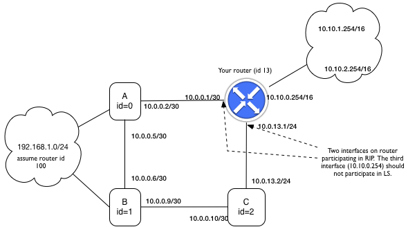

Link state routing
--------------------

Overview
^^^^^^^^

The objective of this exercise is to add a *dynamic routing capability* to a Switchyard-based IPv4 router.  Your router already has a *static* routing capability, in which forwarding table entries are created based on the contents of a preconfigured text file.  In dynamic routing, *reachability* information is shared among routers.  Reachability may change over time, as links or interfaces go down or come back up, and thus routers participating in a dynamic routing protocol build a *current* understanding of where packets must be forwarded in order to reach certain destinations.

The particular variant of dynamic routing to implement in this exercise is *link state* routing.  A real-world implementation of link state routing is the Open Shortest Path First (OSPF) protocol. OSPF is a rather complex protocol, but by necessity: it needs to handle many "interesting" real-world routing situations and network configurations.  Another real-world link state routing protocol is IS-IS ("intermediate system to intermediate system", which is sort of an awkward name). The link state routing protocol described in this exercise is based on OSPF, but with many simplifications [#f1]_.  Below, we refer to our protocol simply as **LS**.

This document is *not* intended to provide a full reference on link state routing; the focus rather on what must be implemented in your Switchyard router to create an OSPF-like dynamic routing capability.  The official specification of the OSPF protocol can be found at https://tools.ietf.org/html/rfc2328, but beware that it is quite lengthy and has lots of detail that we are not going to be concerned with in this exercise.

Overview
^^^^^^^^

LS is a greatly simplified link state routing protocol based on OSPFv2.  Like OSPFv2, routers participating in a LS topology periodically broadcast HELLO packets to discover and maintain a list of neighbors.  Whenever a change in a link status is detected (for example the addition or deletion of a router to the topology or the addition or deletion of a link) or a timeout occurs, each router floods its view of the network throughout the topology so that each router can eventually create a complete database of network connectivity.  Djikstra's algorithm is used by each router independently to determine the next hop in the forwarding table to all advertised routes.

Each router that implements the LS protocol must be identified with a *router id*, which is just a 32-bit integer.  The router id must be unique in a network of routers participating in LS. Each router must also be configured with a parameter *LSUINT*, which is the interval in seconds between link state updates emitted by the router.

In OSPF, each router operates within an *area*.  Although the packet headers created for this exercise contain a field for *area*, we will ignore it in this exercise.  An extension of this exercise could implement a 2-level hierarchy, similar to how the notion of area is treated in OSPF.

Each interface of a router that is participating in LS should have associated with it some additional information related to the operation of LS.  In Switchyard, each interface already has an IPv4 address and subnet mask.  In addition, it should have associated with it a *HELLOINT* value, which is the time interval between sending LS HELLO messages to neighboring routers.  Lastly, related to each interface an LS router should maintain a list of (neighbor router id, neighbor router IP address) (i.e., two items for each neighboring router).  There may be multiple LS routers reachable through a given LS-participating interface, so a list should be maintained.

Hello Protocol
^^^^^^^^^^^^^^

To discover and maintain the state of available links, a router participating in LS periodically listens for and broadcasts HELLO packets.  HELLO packets are emitted every HELLOINT seconds with a multicast destination address of *ALLSPFRouters* that is defined as ``224.0.0.5``.  This implies that all participating routers must be configured to receive and process packets sent to *ALLSPFRouters*.  On receipt of a HELLO packet a router may do one of three things.  If the packet is invalid or corrupt the router should ignore the packet and log the error.  If the packet is from an unknown neighbor router, and no other routers have been identified as neighbors on the interface from which the HELLO arrived, a new neighbor should be added to the interface.  The router IP address recorded should simply be the IPv4 source address in the HELLO packet, and the router id should be taken from the LS header.  If the packet is from an already-identified neighbor, the router should mark the time the HELLO was received in order to track the "aliveness" and uptime of its neighbor, as discussed below.

Note that since each router learns of its adjacent neighbors through HELLO packets, the LS HELLO process acts as the method in which each router learns basic LS network connectivity.  

LS routers use HELLO packets to monitor the health and status of a neighboring router.  If a neighboring router does not emit a HELLO packet within 3*HELLO seconds of the last HELLO received, the router is assumed to have gone down and should be removed from the list of neighbors for the associated interface.  A link state update flood is also initiated (as described below).  

Note that HELLO packets are the *only* method by which a router learns link and neighbor status.  Even if a neighboring router is actively forwarding packets and generating link state update packets, if it has ceased to generate HELLO messages it will be considered dead and removed from the network topology.

The Topology Database and Link State Updates
^^^^^^^^^^^^^^^^^^^^^^^^^^^^^^^^^^^^^^^^^^^^

Every router in a LS network maintains a full representation of the network topology, called *the topology database*.  This topology database is used to calculate the next hop for each destination in the network.  

The topology database is created using link state update, or LSUpdate, messages. If HELLO packets are used for a router to learn about adjacent routers, then Link State Update messages are used to disseminate what a router knows about its neighboring routers to all other routers in the LS-participating network.  

The topology database can really be considered as (1) a store of recent *LSUpdate* messages, including the sequence number of the most recently received message, and (2) some representation of the network topology.  For the network topology, something like an adjacency list or similar data structure could be constructed, but for this exercise, you can use the ``Graph`` class in the ``networkx`` module in Python for representing the network topology.  As a starter, the following lines of code can be used to create a new graph and to add one edge to it::

    import networkx
    G = networkx.Graph()
    G.add_edge(1,2) # add an edge for each adjacent router, by router id
    ...

Global network connectivity is learned by each router through LSUpdate messages in which local link connectivity information (learned from HELLO messages) is flooded throughout the LS-participating network by each router. Link state updates are sent periodically every *LSUINT* seconds **and** whenever a change in link status is detected.  If a link state change initiates a link state update, the LSUINT counter is reset to wait another LSUINT seconds before triggering another flood.

The link state advertisements generated by each router list the subnets of each of the router's interfaces and all neighboring routers.  Link state updates operate via a simple *sequenced*, *unacknowledged* flooding scheme in which received packets are flooded to all neighbors except the neighbor from whom the packet was received.  (Note that this differs from standard OSPF in that LSUpdate messages are not *acknowledged*.)  LSUpdate messages are flooded to all neighbors, and sent directly to each neighbor via its unicast IPv4 address (i.e., not sent to the special *AllSPFRouters* multicast address).  LSUpdate messages are used to build and maintain the network topology database at each router.  If the LSUpdate message does not advertise a change in the state of the topology as is already reflected in the database, it is discarded and the sequence number is updated.  Otherwise, the information is used to update the database and the router's forwarding tables are recalculated using Djikstra's algorithm.

Instead of reinventing the wheel and implementing Dijkstra's algorithm yourself, you may use the implementation in the Python ``networkx`` module, which is convenient if you're storing the network topology as a ``networkx.Graph`` object.  You can call a built-in ``networkx`` function to compute shortest path between the router and all other routers in the network::

    paths = networkx.algorithms.shortest_paths.unweighted.single_source_shortest_path(G, source)
    # returns dictionary of dest, path
    # e.g., paths[2] -> list of nodes

You'll then have to use the computed paths to update the router's forwarding table (note that you really just need the next router in the path, not the full path, to compute the forwarding table entries).

Remember that in addition to learning routes through LS, a router may also be configured with static routes using a text file as in the past.  You will want to be able to identify, in the forwarding table, how a forwarding table entry has been created (i.e., as static entry, as a directly connected network, or through LS) in order to correctly update any LS-learned entries when/if the topology changes.

If there are discrepancies in ``LSUpdate`` messages from two different hosts about the same link, the link is assumed invalid and should *not* be added to the database.  This may happen in the following cases:

  * Host A advertises that it is connected to subnet with mask 255.255.255.0 and neighbor B.  Host B does not advertise that A is a neighbor.

  * Host A advertises that it is connected to subnet with mask 255.255.255.0 and neighbor B.  Host B advertises it is connected to a subnet with mask 255.255.255.240 with neighbor A.

In both of these cases the link should not be added to the advertised database.

Each entry in the database should contain an associated timestamp indicating the last time at which a ``LSUpdate`` message from the associated router was received.  If an LSU has not been received from the router within 3*LSUINT seconds, the topology database entry should be removed from the database.  The effect of this change should be that routes are recomputed (though note that no new ``LSUpdate`` message needs to be sent if the router is not a directly adjacent router).

Handling All Incoming LS-related Packets
^^^^^^^^^^^^^^^^^^^^^^^^^^^^^^^^^^^^^^^^

Each host participating in a LS topology must check the following values on any incoming LS message.  In the LSHeader:

 * The version number field must specify protocol version 2.
 * The area ID found in the header should be 0.

LS does not currently support authentication, however an extension to this exercise could add authentication mechanisms.

Handling Incoming HELLO Packets
^^^^^^^^^^^^^^^^^^^^^^^^^^^^^^^

This section explains the detailed processing of a received LSHello message.  

First, the subnet mask and HELLOINT values in the LSHello header should match those configured for the interface on which the message is received.  If those are valid, then the source IPv4 address (from the IPv4 header) and router id (from the LSHeader) should be used to determine whether the router referred to has been previously observed on the interface.  If not, a new neighboring router has been found and should be noted for the interface.  If the router has been previously observed, the "last hello packet received" timestamp should be updated to reflect the fact that the router is still alive.

Note that periodically your router will need to scan the lists of neighbors associated with each interface and check the "last hello packet received" timestamp to determine whether adjacent LS routers are still alive.  If the timestamp is older than 3*HELLOINT, the neighbor should be declared dead: the associated information (router ID and IP address) should be removed from the list of LS routers for the interface, and an ``LSUpdate`` should be triggered to reflect this information.  The router should also update its topology database to reflect the fact that the neighbor no longer exists (which will result in recomputing forwarding table entries).

Handling Incoming LSUpdate Packets
^^^^^^^^^^^^^^^^^^^^^^^^^^^^^^^^^^

The process when receiving an LSUpdate packet is a bit more complex than for LSHello.  First, the source IPv4 address should be checked: the packet may have been generated by the receiving router, in which case it should be dropped.  Second, if it is from another LS router in the network, then the sequence number in the LSUpdate header should be compared with the sequence number of the last LSUpdate received for the router identified in the router ID field of the LSHeader.  If the sequence number in the received packet is less than or equal to the stored sequence number, the packet should be ignored.  If the sequence is greater than the stored sequence, then the topology database should be updated with the received information.  Note that the list of LSAdvertisements may or may not show any changes to the LS network topology:  if there are changes, then routes and forwarding table entries will need to be computed.  Note also that the router from which the LSUpdate message is received may not have been previously observed.  In that case, you should be careful not to assume that any information already exists in the topology database.

For all valid LSUpdate packets, they should be flooded out all interfaces except the one on which they arrived.  Prior to flooding, the TTL in the LSUpdate header should be decremented.  If the TTL field is zero or less, the packet should be dropped (and not flooded).  Note that the use of the TTL is to prevent LSUpdates from infinitely circulating around the network, but it is likely that a router may see the same LSUpdate more than once because of the nature of the flooding process.

LS Packet Structure
^^^^^^^^^^^^^^^^^^^

There are three packet headers defined: ``LSHeader``, which is the common header for all LS messages, ``LSHello``, and ``LSUpdate``.  In addition, the class ``LSAdvertisement`` defines an individual neighbor advertisement used within an ``LSUpdate`` message.

LSHeader 
""""""""

The ``LSHeader`` must follow an IPv4 header with IP protocol number 89 (the same as OSPFv2, and in Switchyard, ``IPProtocol.OSPF``).  ``LSHello`` packets are sent to destination IP address *ALLSPFRouters* which is defined as ``224.0.0.5`` (0xe0000005).  All ``LSUpdate`` packets are sent *point to point* using the IP address of the neighboring interface as the destination.

The ``LSHeader`` contains three fields of interest:

``msgtype``
  The type of the packet header to follow.  Valid values are either ``LSMessageType.Hello`` or ``LSMessageType.LinkStateUpdate``.

``routerid``
  The 32-bit integer ID of the router generating the packet containing this header.

``areaid``
  Not used in this exercise, but the routing "area" of the router that generated this packet.  Should be left as zero.

The ``LSHeader`` structure is modeled on the OSPFv2 header (and actually contains space for the OSPFv2 checksum and authentication fields).  The reason for using the OSPFv2 header is to allow LS-related packets to be interpreted using standard tools when running in a live environment, like Wireshark.

LSHello
"""""""

This header contains just two fields: ``netmask`` and ``helloint``.

``netmask``
  The network mask associated with the interface from which a ``LSHello`` message is generated.

``helloint``
  The number of seconds between this router's HELLO packets.

An example of constructing a full LS Hello packet is as follows (with many lower-layer headers not filled in)::

    p = Ethernet() + IPv4(protocol=IPProtocol.OSPF) + \
      LSHeader(msgtype=LSMessageType.Hello, routerid=13) + \
      LSHello(netmask="255.255.252.0", helloint=30)

LSUpdate
""""""""

``LSUpdate`` packets are used to disseminate LS router adjacencies that are learned through the "Hello" process.  By flooding LSUpdate messages through the network, each LS router is able to inform all other routers about its adjacencies, and all routers eventually learn the full network topology.

There are two main fields in the ``LSUpdate`` header:

``sequence``
  A unique sequence number associated with each LSUpdate, which should be incremented for each new LSUpdate message generated by a router.  

``ttl``
  A "time to live" value that is considered during LSUpdate flooding as described above.  

In addition to these two fields, an ``LSUpdate`` header can hold 1 or more link state advertisements as ``LSAdvertisement`` objects. Each ``LSAdvertisement`` object has the following properties:

``network``
  This property returns a IPv4Network object (both network address and subnet mask/prefix length).

``address``
  The network address as an IPv4Address object.

``netmask``
  The subnet mask as a IPv4Address object.

``routerid``
  The router id as an integer.

To access individual ``LSAdvertisement`` objects, the ``LSUpdate`` class supports the ``len()`` function and indexing.  That is, calling ``len()`` on a ``LSUpdate`` object will return the number of advertisements contained in the update.  Using an integer index ``i`` with an ``LSUpdate`` object will return the "ith" advertisement object.  Additionally, an ``LSUpdate`` object can be iterated over using a ``for`` loop; for each iteration the next advertisement object is yielded.

Here's an example::

    # construct an LS update packet
    pkt = Ethernet() + IPv4(protocol=IPProtocol.OSPF) + \ 
      LSHeader(msgtype=LSMessageType.LinkStateUpdate, routerid=42, areaid=1) + \
      LSUpdate(ttl=1,sequence=13)

    # add two advertisements to the update
    pkt[LSUpdate].append(LSAdvertisement("149.43.80.25/16", routerid=1))
    pkt[LSUpdate].append(LSAdvertisement("10.0.199.200/22", routerid=1))

    # iterate over the advertisements in the update
    for lsa in pkt[LSUpdate]:
        print(lsa)

    # another way to iterate using len() and indexing 
    update = pkt[LSUpdate]
    i = 0
    while i < len(update):
        lsa = update[i]
        print(lsa)

Implementing LS Protocol Actions
^^^^^^^^^^^^^^^^^^^^^^^^^^^^^^^^

First, you'll want to configure Switchyard's ``IPv4`` header to be able to decode the ``LSHeader`` payload (the ``LSHeader`` is already configured to be able to decode ``LSHello`` and ``LSUpdate`` headers).  One line of code is needed to do this::

    IPv4.add_next_header_class(IPProtocol.OSPF, LSHeader)

Once you've done that, any received LS packet should be correctly interpreted and reconstructed.

The router that has been developed so far can (or should be able to) handle static routing information from a file, do longest prefix match lookups, forward packets, and generate standard ICMP error packets.   To add a link-state routing capability to the router, you should do the following:

1. Modify your start-up function (``main``) to accept two parameters (besides the net object): a ``*interface`` parameter, which should be a list of interfaces that should participate in the LS routing process, and a ``**kwargs`` parameter which should accept various keyword-style parameters given to the main function.  

   The keyword parameters you should be able to supply are:
  
     * ``helloint``: the number of seconds between emitting Hello packets on an LS-participating interface.  

     * ``lsuint``: the number of seconds between emitting LS update packets on an LS-participating interface.

     * ``routerid``: the integer id of this router.

   On start up, you can use the ``-g`` option to ``swyard`` to give a space-separated series of interfaces as well as keyword parameters, which should also be quoted (e.g., ``-g "router-eth0 router-eth1 helloint=10 lsuint=5 routerid=0"``).  Switchyard will convert each of the parameters values to *strings* and pass them into your program, so you will need to convert the keyword parameters (which look like integers, but will be passed as strings).  

   Each of the keyword parameters should have a default value: HELLOINT should default to 10 seconds, LSUINT should default to 5 seconds, and the router id should default to 0.  Note that the default timer values are intentionally low in order to more easily test the "hello" process and link state update process.

2. You will need to expand the information stored in your forwarding table.  At minimum, you will need to include three new fields: *metric*, *last update*, and *how learned*.  

   * The *metric* should be an integer indicating the number of router hops from the current router to a given network.  Any directly connected networks should have metric 0, as should any static entries.  Forwarding table entries learned through LS should have a metric equivalent to the number of hops through the LS-network.  (Note that this value can be obtained from the result of the shortest path computation.)

   * *Last update* is a timestamp that should indicate the last time at which this entry was updated.  

   * *How learned* should give some indication of how the particular forwarding table entry was learned, e.g., through a static entry, through LS, or because it is a directly connected network.  

3. When the router first starts up, it should immediately send out ``LSHello`` messages on each LS-participating interface and continue to do so every HELLOINT seconds.

4. After an ``LSHello`` message is received on an LS-participating interface *and* the message is accepted (i.e., the *helloint* value and the subnet mask match the expected values), the router should start emitting ``LSUpdate`` messages every LSUINT seconds.

5. When ``LSUpdate`` messages are received and accepted from neighboring routers, the router should process them as required: the topology database should be updated and flooded (assuming the TTL permits flooding).  The side-effect of receiving an ``LSUpdate`` message may be that Dijkstra's algorithm is re-run (if the topology changes) and forwarding table entries are updated.

6. Periodically, the router should verify that neighbors have sent ``LSHello`` messages within the last 3*HELLOINT seconds.  If not, the adjacent router should be removed, the topology database should be updated (along with forwarding table entries), and an ``LSUpdate`` message should be emitted to reflect the change.

7. Periodically, the router should check through the topology database to ensure that an ``LSUpdate`` message has been received from the router that originated it in the past 3*LSUINT seconds.  If not, the topology database entry should be removed, routes should recomputed, and forwarding table entries updated.

Tests
^^^^^

The following image shows the network topology assumed in the test scenarios.  Note that only two of three interfaces incident on the router participate in LS.

Extras
^^^^^^

There are several ways in which this exercise could be expanded, if desired:

1. There is currently no authentication in any route advertisements.  Another way to expand this exercise would be to include some form of authentication.  Refer to the RFC for one way in which this could be done.

2.  Other OSPFv2 aspects are also not implemented, such as areas and filling in the checksum in the header.  To have an LS router speak to an OSPFv2 router, say in Mininet, these would need to be addressed.

3. An equal-cost multipath-type of routing could be implemented.  

4. This exercise does not contain any Mininet tests (yet), and an interesting way to expand it would be have multiple Switchyard routers, speaking a OSPFv2 variant, to communicate among themselves within Mininet.  The packets should be able to be interpreted correctly using Wireshark, since the same packet structure is used as in OSPFv2.

5. Some capability could be added to provide controls over whether certain routes are redistributed in LS, e.g., some static routes may only be advertised to certain neighbors.  You might also add various LS counters, of the number of Hello messages, LSUpdates, to query the topology database, etc.  It would be possible also to create a little CLI to query and configure a live router.  You'd need to send log output to a file (easy with a ``swyard`` command-line option) and start the CLI in a separate Python thread (also relatively easy).

.. rubric:: Footnotes

.. [#f1]  The simplifications are based on the "PWOSPF" protocol ("pee-wee OSPF") developed at Stanford University for exercises using the NetFPGA.  See http://yuba.stanford.edu/cs344/admin/pwospf/.  Although "real" OSPF is substantially more complex than PWOSPF, the term is just a bit too "pee-wee" diminutive for my taste --- this is still a complex assignment!

License
^^^^^^^

This work is licensed under a Creative Commons Attribution-NonCommercial-ShareAlike 4.0 International License.
http://creativecommons.org/licenses/by-nc-sa/4.0/
