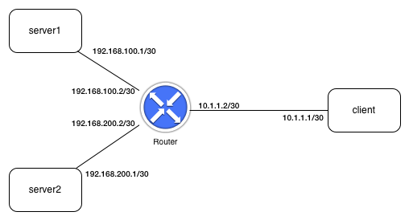
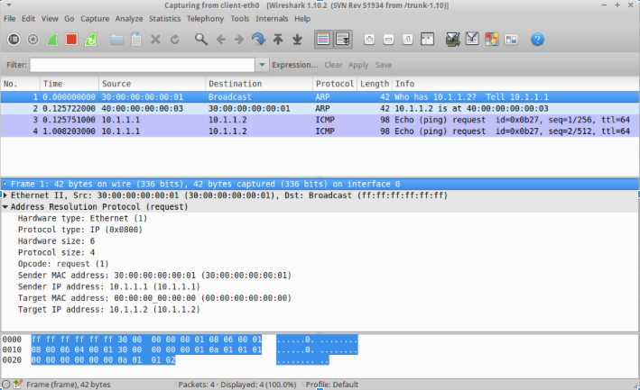
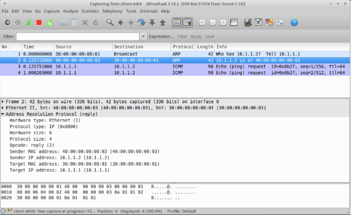

Overview
--------

This project is the first in a series of projects that have the ultimate goal of creating the "brains" for a fully functional Internet IPv4 router.   The basic functions of an Internet router are to:

1. Respond to ARP (address resolution protocol) requests for addresses that are assigned to interfaces on the router.  (Remember that the purpose of ARP is to obtain the Ethernet MAC address associated with an IP address so that an Ethernet frame can be sent to another host over the link layer.)
2. Make ARP requests for IP addresses that have no known Ethernet MAC address.  A router will often have to send packets to other hosts, and needs Ethernet MAC addresses to do so.
3. Receive and forward packets that arrive on links and are destined to other hosts.  Part of the forwarding process is to perform address lookups ("longest prefix match" lookups) in the forwarding information base.  We will eventually just use "static" routing in our router, rather than implement a dynamic routing protocol like RIP or OSPF.
4. Respond to ICMP messages like echo requests ("pings").
5. Generate ICMP error messages when necessary, such as when an IP packet's TTL (time to live) value has been decremented to zero.

The goal of this first router project is to accomplish item #1 above: respond to ARP requests.

Tasks to accomplish
-------------------

In the source directory for this exercise, there is a Python file to use as a starter template: ``myrouter1.py``.  This file contains the outline of a Router class, and currently contains a constructor (``__init__``) method and a ``router_main`` method.  This is just a starter template: you can refactor and redesign the code in any way you like.

If you do not already have a suitable Switchyard development environment set up, you'll need to run the set up script::

    $ ./setup.sh

The main task for this project is to modify the Router class to do the following:

1. Upon receiving a packet, determine whether it is an ARP request.
   
   * For ARP packet headers, there are two types of addresses, as well as source and destination values for each address type, giving a total of four addresses.  For an ARP request, the source Ethernet and IP addresses are filled in, as well as the destination IP address.  Note that the source and destination IP addresses are called ``senderprotoaddr`` and ``targetprotoaddr`` in the ARP header, respectively.  The source and destination Ethernet addresses are called ``senderhwaddr`` and ``targethwaddr``, respectively.  The destination Ethernet address is not filled in: this is the address being requested.

   * Note that the packet header class for ARP is named ``Arp``, so to obtain the ARP header from an incoming packet (if it exists) you can do something like::

        arp = packet.get_header(Arp)

   See the Arp packet header reference in the documentation for more.

   * For each ARP request, you should determine whether the targetprotoaddr field (IP address destination) in the ARP header is an IP address assigned to one of the interfaces on your router.  

     * Remember that you can get a list of interfaces configured for the router by calling the interfaces method (or equivalently, the ports method) on the net object stored in the self.net attribute in the Router class.  The Switchyard documentation has details on what is returned by the interfaces method.  You may wish to call this method in the constructor of the Router class and create some internal data structure for the Router, so it can keep track of its own interfaces.

   * If the destination IP address is one that's assigned to one of the Router's interfaces, you should create and send an appropriate ARP reply.  (If the destination IP address is not assigned to one of the router's interfaces, you should not respond with an ARP reply, even if you have enough information to do so.)  The ARP reply should be sent out the same interface on which the ARP request arrived.

2. If a packet that you receive in the router is not an ARP request, you should ignore it (drop it) for now.  In the next couple projects you'll handle more incoming packet types in your router.

The Switchyard documentation contains a section introducing how Packet parsing and construction works.  This is strongly recommended background reading.  You will also probably find the API reference to be helpful for packet parsing  You may also make use of two helper functions (defined in ``switchyard.lib.packet``, which is already imported in the template file).

* ``create_ip_arp_reply(senderhwaddr, targethwaddr, senderprotoaddr, targetprotoaddr)``
* ``create_ip_arp_request(senderhwaddr, senderprotoaddr, targetprotoaddr)``

Note that these two functions above return a full ``Packet`` object including ``Ethernet`` and ``Arp`` headers, all filled in.

One more note
-------------

You'll eventually need to store a mapping in the Router between destination IP addresses and Ethernet MAC addresses (you can assume there is a one-to-one mapping).  The reason is simple: when you send an IP packet to another host, you'll also need the Ethernet address associated with the destination IP address.  If you "remember" any source IP/Ethernet MAC pairs from ARP requests that are received at the router, it may help you to avoid having to construct and send an ARP request to obtain the same information.  This capability isn't strictly required for this stage of the router project, but it may be helpful to have in place for future projects.

Switchyard testing
------------------

For initial testing and debugging of your code, you can run the Switchyard test scenario (routertests1.srpy).  Run it like this::

    $ ./switchyard/srpy.py -t -s routertests1.srpy myrouter.py 

Read each individual test case output carefully (yes, it can be a lot to read!) since each test case has an explanation for what your code should be doing.  

Mininet ("live") testing
------------------------

Once the Switchyard tests pass, you can test your router in Mininet.  There is a ``start_mininet.py`` script in the project git repo for building the following network topology:

(Note that the above topology may not be the same as the one implied by the Switchyard tests.)

To test your router in Mininet, you do the following:

1. Open up a terminal on the virtual machine, and cd (if necessary) to the folder where your project files are located (or transfer them into the virtual machine).  Then type the following to get Mininet started::

    $ sudo python start_mininet.py

2. Open up an xterm on the client node::

    mininet> xterm client

3. Start up wireshark on the client.  From the xterm running on the client, type::

    client# wireshark -k&

   (Note: you'll get some warnings from Wireshark about running as root, which you can safely ignore.)

4. Open an xterm on the router node::

    mininet> xterm router

5. Start your router::

    router# ./switchyard/srpy.py myrouter1.py

6. Now, in the xterm running on the client, try to send an ICMP echo request to the IP address at the "other end" of the link between the client and the router.

::

    client# ping -c3 10.1.1.2

The router should initially receive an ARP request for its own IP address (which your router will need to correctly respond to!), then it should receive an ICMP echo request.  Since your router isn't yet programmed to respond to ping requests, nothing else should happen (i.e., you'll get ping requests, but they won't be responded to).

In wireshark, you should see something similar to the following details when you click on the ARP request packet  the first line in the capture window).  Notice that the "target MAC address" is currently all zeroes, since this is the address being requested:

Also in wireshark, you should see the following details when you click on the ARP response packet (second line in the capture window).  Notice that all the addresses in the ARP header are now filled in (and that source and destination addresses are effectively swapped):

License
-------

This work is licensed under a Creative Commons Attribution-NonCommercial-ShareAlike 4.0 International License.
http://creativecommons.org/licenses/by-nc-sa/4.0/
