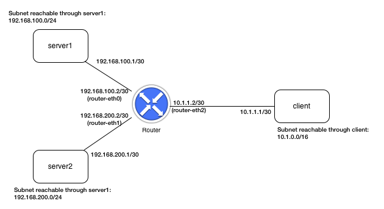
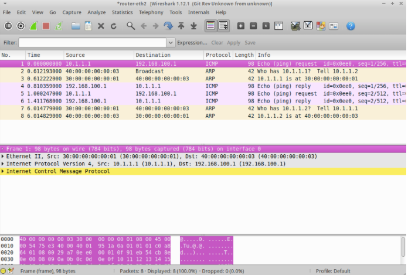

Overview
--------

This is the second in a set of exercises that have the ultimate goal of creating the "brains" for an IPv4 router.   The basic functions of an Internet router are to:

1. Respond to ARP (address resolution protocol) requests for addresses that are assigned to interfaces on the router.  (Remember that the purpose of ARP is to obtain the Ethernet MAC address associated with an IP address so that an Ethernet frame can be sent to another host over the link layer.)

2. Receive and forward packets that arrive on links and are destined to other hosts.  Part of the forwarding process is to perform address lookups ("longest prefix match" lookups) in the forwarding table.  We will just use "static" routing in our router rather than implement a dynamic routing protocol like RIP or OSPF.  

3. Make ARP requests for IP addresses that have no known Ethernet MAC address.  A router will often have to send packets to other hosts, and needs Ethernet MAC addresses to do so.

4. Respond to ICMP messages like echo requests ("pings").

5. Generate ICMP error messages when necessary, such as when an IP packet's TTL (time to live) value has been decremented to zero.

The goal of this stage is accomplish items 2 and 3 above.

Task 1: IP Forwarding Table Lookup
----------------------------------

One of the key tasks to accomplish for this project is to perform the fundamental thing that routers do: receive packets, match their destination addresses against a forwarding table, and forward them out the correct interface.

You will need to implement some kind of forwarding table, with each entry containing the following:

1. A network prefix (e.g., 149.43.0.0),

2. A network "mask" (e.g., 255.255.0.0),

3. The "next hop" IP address, if the destination network prefix is not for a directly attached network, and,

4. The network interface name through which packets destined to the given network should be forwarded.

You will need to build the forwarding table from two sources: the list of router interfaces you get through a call to the ``net.interfaces()``  (or ``net.ports()``) method, and by reading in the contents of a file named ``forwarding_table.txt``.  An example forwarding table file is found in the project directory, and is also recreated each time you either run the test scripts or run your router in Mininet (note that the forwarding table may be different for the test scenario and for Mininet to help ensure that your router behaves in a general way and isn't written just to handle a specific set of forwarding table entries).  Your code can simply assume that a file named ``forwarding_table.txt`` exists in the current working directory.

Note that for each interface object in the list obtained from ``net.interfaces()`` (or, equivalently, ``net.ports()`` ), the IP address assigned to the interface and the network mask are available (see the Switchyard documentation on getting information about interfaces/ports).

The file ``forwarding_table.txt`` can be assumed to exist in the same directory where your router is starting up (again, this file is produced by the Switchyard test scenario or by the Mininet startup script), and is structured such that each line contains 4 space-separated items: the network address, the subnet mask, the next hop address, and the interface through which packets should be forwarded.  Here are three example lines::

    172.16.0.0 255.255.255.0 192.168.1.2 router-eth0
    192.168.200.0 255.255.255.0 192.168.200.1 router-eth1

In the first line, the network address is 172.16.0.0 and the subnet mask is 255.255.0.0 (16 1's followed by 16 0's).  The next hop IP address is 192.168.1.2, and the interface through which to forward packets is named ``router-eth0``.

After you build the forwarding table (which should be done once, upon startup), destination addresses in IP packets received by the router should be matched against the forwarding table.  Remember that in case of two items in the table matching, the longest prefix match should be used.  

Two special cases to consider:

1. If there is no match in the table, just drop the packet.  (We'll handle this better in a later stage of creating the router.)

2. If packet is for the router itself (i.e., destination address is an address of one of the router's interfaces), also drop/ignore the packet.  (We'll also handle this better at a later stage.)

There are a couple functions and methods in the Python 3's ``ipaddress`` library (also available through Switchyard's IP address library) that are helpful for building forwarding table entries and/or for matching destination IP addresses against forwarding table entries:

1. To find out the length of a subnet prefix, you can use the following code pattern::

    from switchyard.lib.address import *
    netaddr = IPv4Network('172.16.0.0/255.255.255.0')
    netaddr.prefixlen # -> 24

Note in the code above that you simply need to concatenate an IP address with '/' and the netmask when constructing a ``IPv4Network`` object.  The resulting object can tell you the length of the prefix in bits, which will be quite helpful.

1. The ``IPv4Address`` class can be converted to an integer using the standard ``int()`` type conversion function.  This function will return the 32-bit unsigned integer representation of an IP address.  Remember that you can use bit-wise operations on Python integers (``&`` is bitwise AND, ``|`` is bitwise OR, ``~`` is bitwise NOT, ``^`` is bitwise XOR).  For example, if we wanted to check whether a given address matches a prefix, we might do something like this::

    prefix = IPv4Address('172.16.0.0') 
    destaddr = IPv4Address('172.16.23.55')
    matches = (int(prefix) & int(destaddr)) == int(prefix)
    # matches -> True

You can also use capabilities in the IPv4Network class to do the same thing::

    prefixnet = IPv4Network('172.16.0.0/16') 
    # same as IPv4Network('172.16.0.0/255.255.0.0')
    matches = destaddr in prefixnet
    # matches -> True

Task 2: Forwarding the Packet and ARP
-------------------------------------

Once you do the forwarding table lookup for an IP destination address, the next steps are to:

1. Decrement the TTL field in the IP header by 1 (you could do this prior to forwarding table lookup, too).  You can assume for this project that the TTL value is greater than 0 after decrementing.  We'll handle "expired" TTLs in the next project.

2. Create a new Ethernet header for the IP packet to be forwarded.  To construct the Ethernet header, you need to know the destination Ethernet MAC address corresponding to the host to which the packet should be forwarded.  The next hop host is either:

   1. the destination host, if the destination address is directly reachable through one of the router interfaces (i.e., the subnet that the destination address belongs to is directly connected to a router interface), or

   2. it is an IP address on a router through which the destination is reachable.

In either case, you will need to send an ARP query in order to obtain the Ethernet address corresponding to the next hop IP address.  For handling ARP queries you should do the following:

* Send an ARP request for the IP address needing to be "resolved" (i.e., the IP address for which you need the corresponding Ethernet address).

  * The Switchyard reference documentation for the ARP header has an example of constructing an ARP request packet.

* When an ARP reply is received, complete the Ethernet header for the IP packet to be forwarded, and send it along.  You should also create a cache of IP addresses and the Ethernet MAC addresses that they correspond to.  When you receive a response to an ARP query, add the IP address->Ethernet address mapping to the cache so that you can avoid doing an identical ARP query.

* If no ARP reply is received within 1 second in response to an ARP request, send another ARP request.  Send up to (exactly) 5 ARP requests for a given IP address.  If no ARP reply is received after 5 requests, give up and drop the packet (and do nothing else).

You will need to carefully structure your code to be able to receive and process incoming packets while you are waiting for replies to ARP requests.  A suggested method is to create a queue that contains information about IP packets awaiting ARP resolution.  Each time through the main while loop in your code, you can process the items in the queue to see whether an ARP request retransmission needs to be sent.  If you receive an ARP reply packet, you could remove an item from the queue, update the ARP table, construct the Ethernet header, and send the packet.  You might create a separate class to represent packets in the queue waiting for ARP responses, with the class containing variables to hold the most recent time an ARP request was sent, and the number of retries, among other things.

  Note: you *can* create a separate Python thread to handle ARP requests.  Switchyard is thread-safe and this is an acceptable pattern.  You may find it easier, however, to simply handle everything in the main thread of the router.  

For keeping track of how long it has been since an ARP request has been sent, you can use the built-in ``time`` module.  It has a ``time`` function that returns the current time in seconds (as a floating point value) (e.g., ``time.time()`` # -> current time in seconds as a float).  

Lastly, refer to the Switchyard documentation details and examples for parsing and constructing packets containing Ethernet, ARP, and IP packet headers.

Some questions and answers
--------------------------

Q: What should the router do in the following scenario:  say a packet for a certain IP address arrives at the router and it sends an ARP request to obtain the corresponding MAC address. Before receiving the ARP reply, the router receives another packet (non-ARP) for the same IP address, should it send an ARP request again?

  A: No, in this case you should not retransmit the ARP request for the second packet. More generally, your router might receive many packets for a certain IP address while there is an outstanding ARP request for that IP address. In this case, your router should not send out any new ARP requests or update the timestamp of the initial ARP request. However, your router should buffer the new data packets so that it can transmit them to the destination host once it receives the ARP reply. IMPORTANT: If your router buffers multiple packets for a destination host that has an outstanding ARP request, upon receiving the corresponding ARP reply these packets has to be forwarded to the destination host in the order they arrived to the router!

Q: When an ARP request arrives at the router for a destination IP address that is not assigned to one of the router's interfaces, does the router need to flood the ARP request, or should it just drop the request?

    A: Your router should drop the packet in this case.

Q: When the router needs to make an ARP request for the next hop IP address (which is obtained after the longest prefix match lookup), should it flood the request on all ports?

    A: The router does *not* flood the ARP request on all ports. The ARP query is merely sent to the broadcast Ethernet address on the port obtained from doing a longest prefix match lookup. The response ARP query *should* come back on the same port but it doesn't actually need to (and it doesn't matter for the purposes of forwarding the packet or sending out the ARP request).

Switchyard testing
------------------

To test your router, you can use the same formula you've used in the past::

    $ swyard -t routertests2.srpy myrouter.py

If you need to step through code to see what's going on, you can add calls to ``debugger()`` at any point in your code.  When execution reaches that line, you'll get a Python debugger (pdb) command line at which you can inspect variables, call methods, etc., in order to understand what's happening.  This kind of debugging will, in general, be much more effective than "printf" debugging.  This project includes quite a bit of complexity, so inspecting variables and stepping through your program in the debugger can be extremely helpful!

Note that the above test scenario file is *not* included in this repository but is available on request.

Mininet ("live") testing
------------------------

Once the Switchyard tests pass, you should test your router in Mininet.  There is a ``start_mininet.py`` available for building the following network topology::

(Note that the above topology is not the same as the one implied by the Switchyard tests.)

To test your router in Mininet, open up a terminal on the virtual machine, and cd (if necessary) to the folder where your project files are located (or transfer them into the virtual machine).   Then type::

    $ sudo python start_mininet.py

Once Mininet starts up, you should open an xterm on the router node (``xterm router``), and type::

    router# swyard myrouter.py

to start the router.  Note again that you may need to activate your Python virtual environment in order for the above command to work correctly.

Note: when you run your router in Mininet, you'll almost certainly receive packets that you didn't ask for!  In particular, you'll likely receive non-IPv4 and non-ARP packets (you'll likely receive some IPv6 packets and some other fun stuff).  You should just ignore these non-IPv4 and non-ARP packets (and your router should not crash when it receives them!)

At this point, you should be able to open another xterm on any one of the other nodes and send a ping (ICMP echo request) to any of the IP addresses configured on any node in the network.  For example, if you open an xterm on client, you should be able to send a ping to 192.168.200.1 (on server2) and 192.168.100.1 (on server1).   You should also be able to send a ping to any address in the subnets 192.168.100.0/24 and 192.168.200.0/24 from the client node, and the router should successfully forward them to either server1 or server2.  (But note that you will only get ping responses from 192.168.100.1 and 192.168.200.1 --- pings to any other IP address will not get a response.)  To test whether the router is correctly forwarding the packets, you can run wireshark on any of the nodes in the network.  Below is an example of starting wireshark on the router using interface router-eth0, then running ping on the client to send 2 ICMP echo requests to 192.168.100.1::

    router# wireshark -i router-eth0
    # then on client
    client# ping -c2 192.168.100.1

Testing your router in the "live" network (i.e., in Mininet) is a major step: if it passes all the tests then works in Mininet when trying various examples of pinging hosts, you might have done things correctly!

License
-------

This work is licensed under a Creative Commons Attribution-NonCommercial-ShareAlike 4.0 International License.
http://creativecommons.org/licenses/by-nc-sa/4.0/
